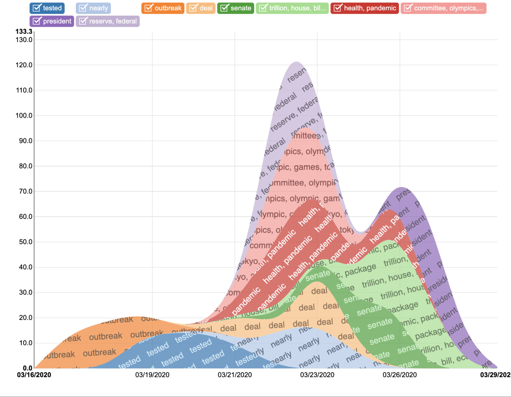
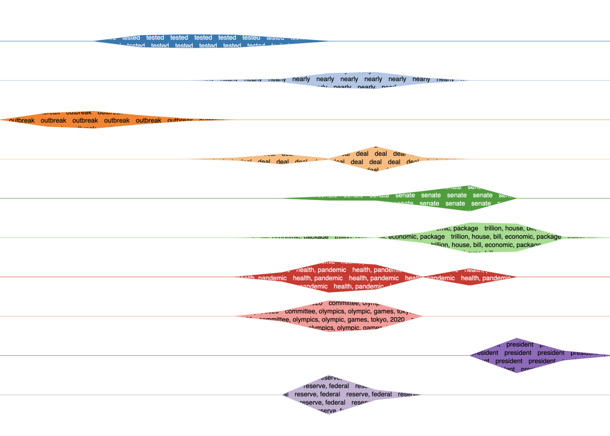
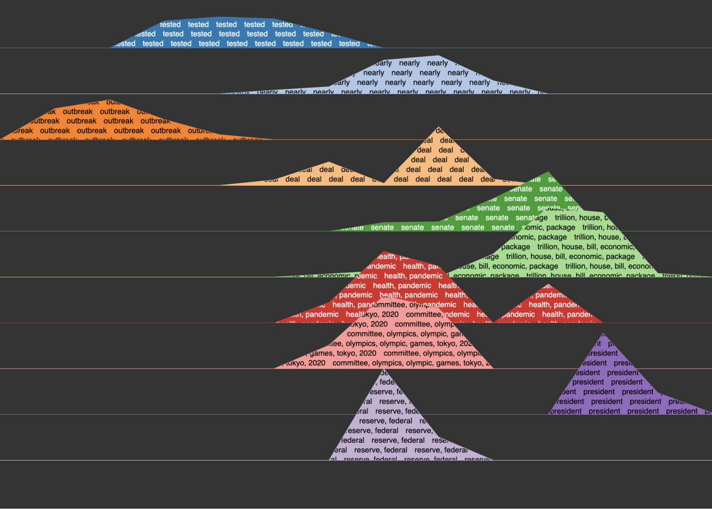

# DECAL: Detect Events with Clustering and Automatic Labeling

This project is a fork of [AdrienGuille/pyMABED](https://github.com/AdrienGuille/pyMABED)

## About

DECAL is a set of improvements over the Python 3 implementation of [MABED](#mabed), distributed under the terms of the MIT licence. If you make use of this software in your research, please cite one the [references](#references) below.

### MABED

MABED (Mention-Anomaly-Based Event Detection) is a statistical method for automatically detecting significant events that most interest Twitter users from the stream of tweets they publish. In contrast with existing methods, it doesn't only focus on the textual content of tweets but also leverages the frequency of social interactions that occur between users (i.e. mentions). MABED also differs from the literature in that it dynamically estimates the period of time during which each event is discussed rather than assuming a predefined fixed duration for all events.

## Installation

```sh
pip install -r requirements.txt
```

## Usage

Provided a set of tweets, pyMABED can (i) perform event detection and (ii) generate a visualization of the detected events.

### Detecting events

Use the `detect_events.py` script, which has two mandatory (positional) arguments:

-   the path to the csv file containing the tweets,formatted as follows: a tweet per line, with at least a field named 'date' (%Y-%m-%d %H:%M:%S) and a field name 'text' (content of the tweet) ; any other field is ignored
-   the number of top events to detect (e.g. 10)

Run the following command to see all the available options:

```sh
python3 detect_events.py --help
```

By default, `detect_events.py` prints the descriptions of the detected events in the terminal, and creates a file named `output.pickle` containing the data needed to generate the visualization (use the `--output` argument to change the output file path).

Corpus discretization is single-threaded but event detection is multi-threaded. Multiple instances can be run at the same time, but be sure that the parameters are different in order to prevent cache conflicts.

If your data includes emoji or other multibyte characters, be sure to remove them beforehand or use the correct encodings for the csv.

### Visualizing events

Use the `build_event_browser.py` script, which has one mandatory (positional) argument:

-   the path to the file that describes the events to visualize (i.e. the path that was passed to `detect_events.py` with the --output argument)

Run the following command to see all the available options:

```sh
python3 build_event_browser.py --help
```

By default, `build_event_browser.py` starts a local Web server accessible at http://localhost:5000/. If a path is passed with the --html-output argument, the visualization is saved on disk in HTML format.

### New chart styles





## Contributors

-   Adrien Guille
-   Nicolas Dugué
-   Corentin F <https://github.com/cogk>

## References

-   Adrien Guille and Cécile Favre (2015)
    [Event detection, tracking, and visualization in Twitter: a mention-anomaly-based approach](https://github.com/AdrienGuille/pyMABED/blob/master/mabed.pdf).
    Springer Social Network Analysis and Mining,
    vol. 5, iss. 1, art. 18 [DOI: 10.1007/s13278-015-0258-0]

-   Adrien Guille and Cécile Favre (2014)
    Mention-Anomaly-Based Event Detection and Tracking in Twitter.
    In Proceedings of the 2014 IEEE/ACM International Conference on
    Advances in Social Network Mining and Analysis (ASONAM 2014),
    pp. 375-382 [DOI: 10.1109/ASONAM.2014.6921613]
